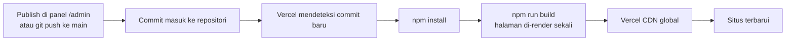

# Portofolio Rian Firnanda Irsyadani

Website portofolio pribadi berbasis **Next.js App Router + Tailwind CSS** yang
dijalankan di **Vercel**. Punya mode terang dan gelap, dua bahasa, halaman blog,
dan **panel konten di `/admin`** sehingga seluruh isinya bisa diubah lewat form
biasa tanpa membuka GitHub.

Seluruh halaman tetap dibuat sekali saat build, jadi kecepatannya sama dengan
situs statis murni.

---

## 1. Ringkasan proyek

**Yang ada di dalamnya**

- **Panel konten di `/admin`** memakai Sveltia CMS. Login dengan GitHub, lalu
  tambah tulisan blog, ubah pengalaman, atau unggah foto langsung dari ponsel.
  Setiap simpan menjadi commit biasa, dan Vercel membangun ulang sendiri.
- Seluruh halaman **pre-render saat build**. Hanya dua endpoint login CMS yang
  berjalan di server.
- Mode **terang dan gelap** dengan tombol di navbar. Pilihan pengunjung diingat
  browser, dan tanpa kedipan warna saat halaman dimuat.
- Toggle bahasa **ID dan EN** memakai satu state React, tanpa library i18n.
- **Blog** lengkap dengan halaman daftar, filter topik, halaman detail per
  tulisan, tombol berbagi, dan data terstruktur untuk mesin pencari.
- Konten sepenuhnya *data-driven*. Menambah item cukup dengan menambah objek ke
  array, tidak ada komponen yang perlu disentuh.
- Setiap pengalaman, proyek, kegiatan sukarela, dan tulisan blog bisa diberi
  **foto sendiri**, dan situs tetap rapi kalau fotonya belum ada.
- **Satu foto profil untuk lima tempat.** Perintah `npm run assets` membuat
  favicon, ikon iOS, dan kartu preview tautan langsung dari foto itu.
- **Pencarian cepat Ctrl+K** yang melompat ke bagian mana pun, lengkap dengan
  tindakan cepat seperti ganti tema, ganti bahasa, dan simpan PDF. Isinya
  dirakit otomatis dari data, jadi tidak ada daftar terpisah yang perlu diurus.
- **Lightbox** untuk semua gambar dokumentasi dan galeri.
- Sentuhan interaktif yang bisa dimatikan satu per satu: sorotan mengikuti
  kursor di kartu, garis progres gulir, angka statistik yang menghitung naik,
  tombol melayang kembali ke atas, dan strip keahlian berjalan.
- Latar berlapis: blob gradien beranimasi, garis grid, titik tekstur, dan
  butiran halus. Kepekatannya bisa disetel, animasinya berhenti otomatis untuk
  pengunjung yang mengaktifkan "kurangi gerakan".
- **Siap dicetak.** Tautan "Simpan sebagai PDF" di footer menghasilkan tata
  letak bersih berlatar putih tanpa navigasi dan elemen dekoratif.
- Font variabel Plus Jakarta Sans di-host sendiri, tidak memanggil server luar.
- SEO lengkap: OpenGraph, Twitter card, canonical, JSON-LD `Person` dan
  `BlogPosting`, plus `robots.txt` dan `sitemap.xml` yang dibuat otomatis.
- Lolos audit aksesibilitas axe-core WCAG 2.1 AA tanpa pelanggaran, di kedua
  mode warna dan di lebar 360 sampai 1440 piksel.
- Tanpa dependency runtime tambahan. Ikon, animasi, dan sistem dua bahasa
  ditulis sendiri di dalam proyek ini.

**Struktur folder**

| Berkas atau folder | Fungsi |
| --- | --- |
| `content/` | **Sumber utama konten.** Seluruh isi situs sebagai berkas JSON, satu berkas per bagian, plus satu berkas per tulisan blog di `content/posts/`. |
| `data/portfolio.js` | Perakit tipis yang menyatukan berkas di `content/` menjadi satu objek. |
| `data/posts.js` | Membaca folder `content/posts/` saat build. |
| `data/README.md` | Panduan operasional dengan cuplikan siap tempel, termasuk cara memasang panel konten. |
| `public/media/` | Semua berkas yang diunggah lewat panel: gambar, video, musik, PDF. |
| `public/google*.html` | Berkas verifikasi Google Search Console. **Jangan dihapus**, Google memeriksanya ulang secara berkala. |
| `content/feedback/` | Masukan dari tamu, satu berkas per kiriman, dibuat otomatis oleh situs. |
| `public/admin/index.html` dan `config.yml` | Halaman panel konten dan definisi form-nya. |
| `app/api/auth/` dan `app/api/callback/` | Dua endpoint login GitHub untuk panel konten. |
| `app/api/feedback/` | Penerima kiriman formulir masukan, menyimpannya ke `content/feedback/`. |
| `lib/oauth.js` | Bagian bersama kedua endpoint login di atas. |
| `lib/github.js` | Menitipkan berkas masukan baru ke repositori. |
| `lib/markdown.js` | Mengubah tulisan blog menjadi HTML, sekaligus menyisipkan pemutar video, musik, dan PDF. |
| `scripts/copy-cms.mjs` | Menyalin berkas panel dari node_modules saat build. |
| `app/layout.js` | Kerangka HTML, metadata SEO, JSON-LD, font, skrip anti kedip tema, provider tema dan bahasa. |
| `app/page.js` | Server component yang menyusun urutan section halaman utama. |
| `app/blog/page.js` | Halaman daftar tulisan. |
| `app/blog/[slug]/page.js` | Halaman detail satu tulisan, dibuat otomatis dari isi `content/posts/`. |
| `app/globals.css` | Token warna mode terang dan gelap, kelas `.glass`, keyframes, pengaturan kepekatan latar. |
| `app/sitemap.js` dan `app/robots.js` | Membuat `sitemap.xml` dan `robots.txt` saat build. |
| `app/cetak/portofolio/` dan `app/cetak/cv/` | Dua halaman dokumen siap disimpan sebagai PDF. |
| `app/cetak.css` | Gaya kedua dokumen itu, termasuk ukuran kertas dan aturan pemenggalan halaman. |
| `components/DokumenPortofolio.jsx` | Dokumen portofolio berwarna, untuk dibaca manusia. |
| `components/DokumenCV.jsx` | CV satu kolom gaya Harvard, ramah mesin pelacak lamaran. |
| `components/DokumenBilah.jsx` | Bilah tombol di atas dokumen, tidak ikut tercetak. |
| `components/ChromeGate.jsx` | Menyembunyikan navbar dan footer di halaman dokumen. |
| `app/not-found.js` | Halaman 404. |
| `app/icon.png` dan `app/apple-icon.png` | Favicon dan ikon iOS, dibuat dari foto profil oleh `npm run assets`. |
| `app/fonts/` | Berkas font variabel yang di-host sendiri. |
| `components/Navbar.jsx` | Pill kaca melayang, sorot section aktif, drawer mobile, toggle bahasa dan tema. |
| `components/Hero.jsx` | Layar pembuka: foto, nama bergradien, kalimat pembuka, dua tombol, ikon sosial. |
| `components/About.jsx` | Ringkasan, strip statistik, daftar bahasa. |
| `components/Experience.jsx` dan `ExperienceCard.jsx` | Timeline vertikal, deskripsi bisa dibuka, chip keahlian, foto opsional. |
| `components/Projects.jsx` dan `ProjectCard.jsx` | Grid proyek dengan filter tag otomatis. |
| `components/Publications.jsx` | Kartu riset dengan abstrak yang bisa dibuka. |
| `components/Skills.jsx` | Kelompok keahlian berbentuk chip. |
| `components/Certifications.jsx` | Grid sertifikasi. |
| `components/Education.jsx` dan `Volunteering.jsx` | Pendidikan dan kegiatan sukarela. |
| `components/BlogPreview.jsx` | Tiga tulisan terbaru di halaman utama. |
| `components/BlogIndex.jsx` | Isi halaman `/blog` beserta filter topik. |
| `components/PostArticle.jsx` dan `PostBody.jsx` | Halaman artikel dan perender blok tulisan. |
| `components/PostCard.jsx` | Kartu tulisan di daftar blog. |
| `components/PostAudio.jsx` | Pemutar audio pendamping di bawah judul artikel, lengkap dengan kecepatan putar. |
| `components/Feedback.jsx` | Formulir masukan untuk tamu, boleh anonim, lengkap dengan penyaring robot. |
| `components/MusicPlayer.jsx` | Pemutar musik kecil di pojok kiri bawah, daftar lagunya dari panel. |
| `components/Contact.jsx` | Kartu kontak, tombol email, salin alamat, daftar sosial, layanan. |
| `components/Footer.jsx` | Identitas singkat, tautan cepat, sosial, tombol ke atas. |
| `components/GlassCard.jsx` | Primitif kaca tunggal yang dipakai ulang semua kartu. |
| `components/SmartImage.jsx` | Tag gambar yang menambahkan base path dan punya gambar cadangan. |
| `components/MeshBackground.jsx` | Latar berlapis yang mengikuti tema. |
| `components/ThemeProvider.jsx` dan `ThemeToggle.jsx` | State dan tombol mode terang atau gelap. |
| `components/LanguageProvider.jsx` | State bahasa ID dan EN. |
| `components/Icon.jsx` | Peta ikon SVG inline, tanpa library ikon. |
| `components/Reveal.jsx` dan `hooks/useReveal.js` | Animasi muncul saat digulir. |
| `components/ScrollProgress.jsx` | Garis progres gulir di tepi atas layar. |
| `components/BackToTop.jsx` | Tombol melayang kembali ke atas. |
| `components/CountUp.jsx` | Angka statistik yang menghitung naik saat masuk layar. |
| `components/SkillMarquee.jsx` | Strip keahlian berjalan di bawah Hero. |
| `components/ShareButtons.jsx` | Tombol berbagi di bawah tulisan blog. |
| `components/CommandPalette.jsx` | Pencarian cepat Ctrl+K beserta tombol pemicunya di navbar. |
| `components/LightboxProvider.jsx` | Lapisan tampilan gambar besar untuk seluruh situs. |
| `components/AboutGallery.jsx` | Strip gambar kegiatan di section Tentang Saya. |
| `scripts/generate-assets.mjs` | Membuat favicon, ikon iOS, dan kartu preview dari foto profil. |
| `scripts/generate-placeholders.mjs` | Membuat gambar placeholder bergaya seragam untuk Pengalaman dan galeri. |
| `lib/i18n.js` | Helper `t()` pemilih teks ID atau EN. |
| `lib/asset.js` | Helper `withBasePath()` untuk path gambar dan berkas. |
| `lib/format.js` | Format tanggal dan perkiraan lama baca. |
| `lib/theme.js` | Kunci penyimpanan pilihan tema. |
| `public/images/` | Foto profil, sampul proyek, sampul tulisan, gambar preview. |
| `next.config.mjs` | `trailingSlash`, pengalihan `/admin`, dan dukungan `basePath`. |

---

## 2. Menjalankan di komputer sendiri

Butuh **Node.js 20 atau lebih baru**.

```bash
# 1. Pasang dependency
npm install

# 2. Jalankan mode pengembangan
npm run dev
# buka http://localhost:3000

# 3. Build versi produksi, menghasilkan folder out/
npm run build

# 4. Uji hasil build secara lokal
npm start

# 5. Buat ulang favicon, ikon iOS, dan kartu preview dari foto profil.
#    Jalankan setiap kali foto di public/images/profile.jpg diganti.
npm run assets

# 6. Buat ulang gambar placeholder untuk Pengalaman dan galeri Tentang Saya.
#    Hanya perlu dijalankan kalau kamu menambah placeholder baru.
npm run placeholders
```

Panel konten di `/admin` juga jalan saat `npm run dev`. Pilih **Work with Local
Repository** di layar login untuk mengedit berkas di komputer tanpa perlu
menyentuh repositori online.

---

## 3. Alur deploy di Vercel



Vercel mengenali proyek Next.js secara otomatis, jadi tidak ada pengaturan yang
perlu diisi manual. Framework Preset `Next.js`, Build Command `npm run build`,
dan Output Directory dibiarkan kosong sudah benar.

**Yang perlu diperbarui satu kali setelah domain Vercel kamu jadi:**

```js
// data/portfolio.js
meta: {
  baseUrl: 'https://domain-kamu.vercel.app',  // tanpa garis miring di akhir
}
```

Nilai itu dipakai untuk canonical URL, `sitemap.xml`, `robots.txt`, dan gambar
preview saat link dibagikan. Selama masih salah, situsnya tetap jalan normal,
hanya metadata SEO-nya yang menunjuk alamat keliru.

**Memasang domain sendiri.** Buka dashboard Vercel, pilih proyeknya, masuk ke
**Settings** lalu **Domains**, tambahkan domainmu, dan ikuti petunjuk DNS yang
Vercel tampilkan. Setelah aktif, perbarui `meta.baseUrl` seperti di atas.

**Catatan soal hosting lain.** Panel konten membutuhkan dua endpoint kecil di
`app/api/`, jadi situs ini tidak lagi bisa disajikan sebagai folder statis murni
seperti di GitHub Pages. Kalau suatu saat kamu memang ingin pindah ke sana,
hapus folder `app/api/` beserta panel di `public/admin/`, lalu kembalikan
`output: 'export'` di `next.config.mjs`. Isi situsnya tetap bisa diubah lewat
berkas di folder `content/`.

---

## 4. Panel konten di /admin

Seluruh isi situs bisa diubah lewat form biasa di
**https://rianfirnanda.vercel.app/admin**, tanpa membuka GitHub. Setiap kali
kamu menekan Publish, panel menulis commit ke repositori dan Vercel membangun
ulang situsnya sendiri dalam satu sampai dua menit.

### Pemasangan awal, cukup sekali

Panelnya sudah terpasang di kode. Yang tersisa hanya izin login, karena itu
menyangkut akun GitHub kamu sendiri.

**Langkah 1.** Buka https://github.com/settings/developers, tab **OAuth Apps**,
klik **New OAuth App**, lalu isi:

| Kolom | Isi |
| --- | --- |
| Application name | `Panel Konten Portofolio` |
| Homepage URL | `https://rianfirnanda.vercel.app` |
| Authorization callback URL | `https://rianfirnanda.vercel.app/api/callback/` |

Perhatikan garis miring di akhir callback URL. Harus sama persis, kalau tidak
GitHub akan menolak dengan pesan `redirect_uri_mismatch`.

Setelah **Register application**, salin **Client ID**, lalu klik **Generate a
new client secret** dan salin nilainya. Rahasia itu hanya ditampilkan sekali.

**Langkah 2.** Di dashboard Vercel, buka proyek ini, masuk ke **Settings**, lalu
**Environment Variables**, dan tambahkan dua variabel untuk environment
**Production**:

| Name | Value |
| --- | --- |
| `GITHUB_CLIENT_ID` | Client ID dari langkah 1 |
| `GITHUB_CLIENT_SECRET` | Client secret dari langkah 1 |

Satu variabel lagi diperlukan **hanya kalau kamu memakai formulir masukan**:

| Name | Value |
| --- | --- |
| `GITHUB_CONTENT_TOKEN` | Fine-grained token dengan izin Contents: Read and write, khusus repositori ini |

Sebelum mengisi variabel itu, jadikan repositori ini privat lebih dulu. Masukan
dari tamu tersimpan di dalam repositori, dan repositori publik berarti siapa pun
bisa membacanya. Langkah lengkapnya ada di `data/README.md` bagian 19.

Terakhir, buka tab **Deployments** dan **Redeploy** deployment terakhir.
Variabel baru hanya terbaca oleh deployment yang dibuat setelahnya.

Selesai. Buka `/admin`, klik **Sign In with GitHub**, beri izin sekali.

### Cara kerja dan keamanannya

Panelnya adalah Sveltia CMS, disajikan dari domain sendiri (berkasnya disalin
dari `node_modules` setiap build oleh `scripts/copy-cms.mjs`), jadi tidak ada
ketergantungan CDN pihak ketiga.

Login memakai dua endpoint di proyek yang sama:

| Endpoint | Tugasnya |
| --- | --- |
| `app/api/auth/route.js` | Mengantar ke halaman izin GitHub, menitipkan kode acak anti pemalsuan permintaan di cookie |
| `app/api/callback/route.js` | Menukar kode dari GitHub menjadi token akses |

Client secret hanya dipakai di sisi server dan tidak pernah ikut terkirim ke
browser. Yang bisa menyimpan perubahan hanya akun GitHub dengan akses tulis ke
repositori. Halaman panel juga ditandai `noindex`.

Panduan lengkap isi panel, cara menulis blog di sana, dan daftar masalah yang
mungkin muncul ada di
[`data/README.md` bagian 17](data/README.md#17-panel-konten-di-admin).

---

## 5. Mengganti isi situs

Semua ada di **[`data/README.md`](data/README.md)**, ditulis langkah demi langkah
dengan contoh yang tinggal disalin. Isinya mencakup:

| Yang ingin diubah | Bagian di panduan |
| --- | --- |
| Mengganti foto profil | Bagian 1 |
| Menambah pengalaman kerja | Bagian 3 |
| Menambahkan foto ke pengalaman dan proyek | Bagian 4 |
| Menambah proyek | Bagian 5 |
| Menulis tulisan blog baru | Bagian 6 |
| Menambah media sosial | Bagian 8 |
| Mengganti warna aksen | Bagian 9 |
| Mengatur mode awal terang atau gelap | Bagian 10 |
| Menyetel kepekatan latar belakang | Bagian 11 |
| Menyembunyikan satu section | Bagian 14 |
| Mematikan animasi dan sentuhan interaktif | Bagian 16 |
| Mengatur galeri di Tentang Saya | Bagian 4 |
| Mengganti gambar placeholder dengan foto asli | Bagian 4 |

### Yang paling sering ditanyakan

**Mengganti foto profil.** Timpa `public/images/profile.jpg` dengan foto baru
berbentuk persegi minimal 640 x 640 piksel, lalu jalankan `npm run assets`.
Perintah itu membuat ulang favicon, ikon iOS, dan kartu preview tautan supaya
semuanya ikut memakai foto yang sama.

**Mengganti warna aksen.** Ubah tiga baris di `app/globals.css`:

```css
:root {
  --accent-1: #6366f1;
  --accent-2: #a855f7;
  --accent-3: #06b6d4;
}
```

**Menulis tulisan blog.** Salin satu objek di `data/posts.js`, tempel di posisi
paling atas, ganti isinya. Halaman detail, filter topik, dan sitemap menyesuaikan
sendiri.

---

## 6. Troubleshooting

### Foto tidak muncul, yang tampil kartu monogram RF

Berarti berkas fotonya belum ada di lokasi yang ditulis di data. Periksa tiga hal:

1. Nama berkas persis sama, termasuk huruf besar kecil dan ekstensinya.
   `Profile.JPG` berbeda dengan `profile.jpg`.
2. Berkasnya benar-benar berada di dalam folder `public/`.
3. Path di `data/portfolio.js` ditulis mulai dari `/`, dihitung dari folder
   `public`. Yang benar `'/images/profile.jpg'`, bukan `'public/images/profile.jpg'`
   atau `'./images/profile.jpg'`.

Ini bukan error. Gambar cadangan memang sengaja disiapkan supaya tampilan situs
tidak pernah rusak.

### Warna berkedip sesaat saat halaman dibuka

Seharusnya tidak terjadi. Ada skrip kecil di `app/layout.js` yang memasang tema
sebelum halaman digambar. Kalau kedipan tetap muncul, biasanya penyebabnya
skrip itu terhapus atau ada extension browser yang memblokir skrip inline.

### Gambar dan CSS hilang setelah dipindah ke hosting lain

Kalau situs disajikan dari sub folder, aset perlu diberi awalan. Isi
`NEXT_PUBLIC_BASE_PATH` dengan `/nama-folder` saat build. Di Vercel variabel itu
harus dibiarkan kosong.

Kalau kamu menambahkan gambar lewat tag `` sendiri, pakai komponen
`SmartImage` atau bungkus path-nya dengan `withBasePath()`:

```jsx
import { withBasePath } from '@/lib/asset';


```

### Halaman 404 saat di-refresh

`next.config.mjs` sudah menyetel `trailingSlash: true`, jadi setiap halaman
diekspor sebagai folder berisi `index.html`. Jangan hapus opsi itu, dan pakai
komponen `<Link>` dari `next/link` untuk tautan antar halaman, bukan `<a href>`
biasa.

### Build gagal karena komponen client

Pesan errornya kira-kira begini:

```
You're importing a component that needs `useState`. This React hook only works
in a client component. To fix, mark the file with the "use client" directive.
```

Artinya ada `useState`, `useEffect`, `onClick`, atau `useRef` di berkas yang
tidak diawali `'use client'`. Tambahkan baris berikut di **baris paling atas**
berkas itu, sebelum semua `import`:

```jsx
'use client';
```

Aturan main di proyek ini:

- `app/page.js`, `app/layout.js`, `app/blog/page.js`, `app/blog/[slug]/page.js`,
  dan `components/MeshBackground.jsx` adalah **server component**. Tidak boleh
  punya state maupun event handler.
- Semua komponen interaktif di `components/` sudah ditandai `'use client'`.
- Berkas di `data/` dan `lib/` netral, aman diimpor dari keduanya.

> Catatan yang mudah terlewat: nilai apa pun yang diekspor dari berkas
> `'use client'` **tidak bisa dibaca** dari server component. Itu sebabnya
> kunci penyimpanan tema diletakkan di `lib/theme.js`, bukan di
> `components/ThemeProvider.jsx`.

### Error lain yang umum

| Pesan | Penyebab | Perbaikan |
| --- | --- | --- |
| `export const dynamic = "force-static" not configured` | Route handler dipakai bersama `output: 'export'` | Tambahkan `export const dynamic = 'force-static';` di berkas itu. `app/robots.js` dan `app/sitemap.js` sudah punya. |
| `Image Optimization ... not compatible with export` | Memakai `next/image` tanpa `unoptimized` | Sudah diatasi lewat `images: { unoptimized: true }`. Untuk gambar baru pakai `SmartImage`. |
| `npm ci` gagal | `package-lock.json` tidak ikut ter-commit | Jalankan `npm install` lalu commit berkas itu |

---

## 7. Teknologi

| Paket | Versi | Kegunaan |
| --- | --- | --- |
| `next` | 16.3.4 | Framework dan static export |
| `react` dan `react-dom` | 19.2.8 | Pustaka antarmuka |
| `tailwindcss` | 4.3.3 | Styling utility-first |
| `@tailwindcss/postcss` | 4.3.3 | Integrasi Tailwind ke PostCSS |
| `sharp` | 0.35.4 | Hanya dipakai `npm run assets` untuk membuat favicon dan kartu preview. Tidak ikut ke dalam situs. |
| `@sveltia/cms` | 0.205.4 | Panel konten di `/admin`. Berkasnya disalin ke `public/admin/` saat build, tidak ikut ke dalam bundel situs. |

Perintah `npm run placeholders` tidak memakai dependency apa pun, hanya modul
bawaan Node.

Tidak ada dependency lain. Ikon, animasi, dan sistem dua bahasa ditulis sendiri.

---

## 8. Fitur yang ditambahkan belakangan

| Fitur | Di mana diatur | Catatan |
| --- | --- | --- |
| Menulis blog tanpa blok | Panel, Tulisan Blog | Satu editor teks biasa. Alamat, waktu baca, dan ringkasan dihitung otomatis. |
| Unggah video, musik, PDF | Panel, tombol Audio, Video, dan Dokumen di editor | Tampilannya dipilih otomatis sesuai jenis berkas. Batas 40 MB per berkas. |
| Audio pendamping tulisan | Panel, Tulisan Blog, Audio pendamping | Pemutar di bawah judul artikel, seperti tombol dengarkan di Substack. Ada mundur 15 detik dan kecepatan putar. |
| Kartu nama dan motto di foto | Panel, Profil Diri, Kartu pada foto | Dua baris di bawah foto profil. Kosongkan mottonya kalau ingin nama saja. |
| Pemutar musik | Panel, Pengaturan, Musik | Tidak pernah berbunyi sendiri. Lihat `data/README.md` bagian 18. |
| Masukan dari tamu | Panel, Masukan Masuk | Butuh `GITHUB_CONTENT_TOKEN` dan repositori privat. Lihat bagian 19. |

Kolom **English** di seluruh panel boleh dikosongkan. Kalau kosong, versi Inggris
situs memakai teks Indonesianya.

---

## 9. Dua berkas unduhan

| Berkas | Alamat | Untuk siapa |
| --- | --- | --- |
| Portofolio | `/cetak/portofolio/` | Manusia. Berfoto, berwarna, sertifikasi dua kolom. |
| CV | `/cetak/cv/` | Mesin pelacak lamaran dulu, baru perekrut. Satu kolom, Arial, tanpa gambar. |

Keduanya halaman tersendiri yang dirancang khusus untuk kertas, bukan hasil
mencetak halaman utama. Isinya diambil dari data yang sama, jadi ikut berubah
setiap kamu memperbarui sesuatu lewat panel.

Tautannya ada di footer dan di pencarian cepat Ctrl+K. Penjelasan lengkap
beserta alasan di balik tiap keputusan desainnya ada di `data/README.md`
bagian 21.

## 10. Mesin pencari

`robots.txt`, `sitemap.xml`, judul, deskripsi, alamat kanonik, dan data
terstruktur `Person` semuanya sudah terpasang dan dibuat otomatis saat build.

Yang masih perlu dikerjakan sekali: mendaftarkan situs ke Google Search Console
dan mengisi kolom **Kode verifikasi Google** di panel. Langkahnya ada di
`data/README.md` bagian 22.

---

## 11. Optimalisasi performa

Pengoptimal gambar bawaan Next.js dulu dimatikan karena situsnya disajikan
sebagai berkas statis di GitHub Pages. Setelah pindah ke Vercel, pengaturan itu
tertinggal dan tidak pernah dinyalakan lagi, padahal di sana tersedia penuh.

Hasil pengukuran di ponsel dengan prosesor diperlambat empat kali:

| Ukuran | Sebelum | Sesudah |
| --- | --- | --- |
| Total diunduh | 4,62 MB | 1,14 MB |
| Di antaranya gambar | 3,80 MB | 0,27 MB |
| Waktu tampil pertama | 492 ms | 308 ms |
| Waktu terblokir | 311 ms | 134 ms |

Dua perubahan yang menghasilkan itu:

**Gambar dioptimalkan.** Ponsel menerima gambar seukuran layarnya dalam format
AVIF atau WebP, bukan berkas asli dari kamera. Hasil olahannya disimpan di tepi
jaringan selama 31 hari. Tampilannya sama persis.

**Pemutar musik dan pencarian cepat dimuat belakangan.** Keduanya baru berguna
setelah pengunjung melakukan sesuatu, jadi kodenya dipisah dan diambil setelah
halaman siap. Pintasan Ctrl+K tetap bekerja.

Berkas media yang diunggah lewat panel adalah faktor terbesar berikutnya. Lihat
`data/README.md` bagian 24.
