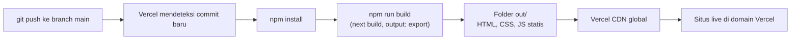

# Portofolio Rian Firnanda Irsyadani

Website portofolio pribadi berbasis **Next.js App Router + Tailwind CSS**, yang
diekspor sepenuhnya menjadi HTML, CSS, dan JavaScript statis lalu dijalankan di
**Vercel**. Punya mode terang dan gelap, dua bahasa, halaman blog, dan seluruh
isinya diatur dari satu berkas data.

---

## 1. Ringkasan proyek

**Yang ada di dalamnya**

- Static export penuh (`output: 'export'`). Tidak ada server, tidak ada API route.
- Mode **terang dan gelap** dengan tombol di navbar. Pilihan pengunjung diingat
  browser, dan tanpa kedipan warna saat halaman dimuat.
- Toggle bahasa **ID dan EN** memakai satu state React, tanpa library i18n.
- **Blog** lengkap dengan halaman daftar, filter topik, halaman detail per
  tulisan, tombol berbagi, dan data terstruktur untuk mesin pencari.
- Konten sepenuhnya *data-driven*. Menambah item cukup dengan menambah objek ke
  array, tidak ada komponen yang perlu disentuh.
- Setiap pengalaman, proyek, kegiatan sukarela, dan tulisan blog bisa diberi
  **foto sendiri**, dan situs tetap rapi kalau fotonya belum ada.
- **Satu foto profil untuk lima tempat.** Perintah `npm run assets` membuat
  favicon, ikon iOS, dan kartu preview tautan langsung dari foto itu.
- Sentuhan interaktif yang bisa dimatikan satu per satu: sorotan mengikuti
  kursor di kartu, garis progres gulir, angka statistik yang menghitung naik,
  tombol melayang kembali ke atas, dan strip keahlian berjalan.
- Latar berlapis: blob gradien beranimasi, garis grid, titik tekstur, dan
  butiran halus. Kepekatannya bisa disetel, animasinya berhenti otomatis untuk
  pengunjung yang mengaktifkan "kurangi gerakan".
- **Siap dicetak.** Tautan "Simpan sebagai PDF" di footer menghasilkan tata
  letak bersih berlatar putih tanpa navigasi dan elemen dekoratif.
- Font variabel Plus Jakarta Sans di-host sendiri, tidak memanggil server luar.
- SEO lengkap: OpenGraph, Twitter card, canonical, JSON-LD `Person` dan
  `BlogPosting`, plus `robots.txt` dan `sitemap.xml` yang dibuat otomatis.
- Lolos audit aksesibilitas axe-core WCAG 2.1 AA tanpa pelanggaran, di kedua
  mode warna dan di lebar 360 sampai 1440 piksel.
- Tanpa dependency runtime tambahan. Ikon, animasi, dan sistem dua bahasa
  ditulis sendiri di dalam proyek ini.

**Struktur folder**

| Berkas atau folder | Fungsi |
| --- | --- |
| `data/portfolio.js` | **Sumber utama konten.** Profil, pengalaman, proyek, sertifikasi, keahlian, kontak, menu, judul section, dan sakelar `appearance`. |
| `data/posts.js` | Semua tulisan blog beserta isinya. |
| `data/README.md` | Panduan operasional dengan cuplikan siap tempel. |
| `app/layout.js` | Kerangka HTML, metadata SEO, JSON-LD, font, skrip anti kedip tema, provider tema dan bahasa. |
| `app/page.js` | Server component yang menyusun urutan section halaman utama. |
| `app/blog/page.js` | Halaman daftar tulisan. |
| `app/blog/[slug]/page.js` | Halaman detail satu tulisan, dibuat otomatis dari `data/posts.js`. |
| `app/globals.css` | Token warna mode terang dan gelap, kelas `.glass`, keyframes, pengaturan kepekatan latar. |
| `app/sitemap.js` dan `app/robots.js` | Membuat `sitemap.xml` dan `robots.txt` saat build. |
| `app/not-found.js` | Halaman 404. |
| `app/icon.svg` dan `app/fonts/` | Favicon dan berkas font. |
| `components/Navbar.jsx` | Pill kaca melayang, sorot section aktif, drawer mobile, toggle bahasa dan tema. |
| `components/Hero.jsx` | Layar pembuka: foto, nama bergradien, kalimat pembuka, dua tombol, ikon sosial. |
| `components/About.jsx` | Ringkasan, strip statistik, daftar bahasa. |
| `components/Experience.jsx` dan `ExperienceCard.jsx` | Timeline vertikal, deskripsi bisa dibuka, chip keahlian, foto opsional. |
| `components/Projects.jsx` dan `ProjectCard.jsx` | Grid proyek dengan filter tag otomatis. |
| `components/Publications.jsx` | Kartu riset dengan abstrak yang bisa dibuka. |
| `components/Skills.jsx` | Kelompok keahlian berbentuk chip. |
| `components/Certifications.jsx` | Grid sertifikasi. |
| `components/Education.jsx` dan `Volunteering.jsx` | Pendidikan dan kegiatan sukarela. |
| `components/BlogPreview.jsx` | Tiga tulisan terbaru di halaman utama. |
| `components/BlogIndex.jsx` | Isi halaman `/blog` beserta filter topik. |
| `components/PostArticle.jsx` dan `PostBody.jsx` | Halaman artikel dan perender blok tulisan. |
| `components/PostCard.jsx` | Kartu tulisan di daftar blog. |
| `components/Contact.jsx` | Kartu kontak, tombol email, salin alamat, daftar sosial, layanan. |
| `components/Footer.jsx` | Identitas singkat, tautan cepat, sosial, tombol ke atas. |
| `components/GlassCard.jsx` | Primitif kaca tunggal yang dipakai ulang semua kartu. |
| `components/SmartImage.jsx` | Tag gambar yang menambahkan base path dan punya gambar cadangan. |
| `components/MeshBackground.jsx` | Latar berlapis yang mengikuti tema. |
| `components/ThemeProvider.jsx` dan `ThemeToggle.jsx` | State dan tombol mode terang atau gelap. |
| `components/LanguageProvider.jsx` | State bahasa ID dan EN. |
| `components/Icon.jsx` | Peta ikon SVG inline, tanpa library ikon. |
| `components/Reveal.jsx` dan `hooks/useReveal.js` | Animasi muncul saat digulir. |
| `components/ScrollProgress.jsx` | Garis progres gulir di tepi atas layar. |
| `components/BackToTop.jsx` | Tombol melayang kembali ke atas. |
| `components/CountUp.jsx` | Angka statistik yang menghitung naik saat masuk layar. |
| `components/SkillMarquee.jsx` | Strip keahlian berjalan di bawah Hero. |
| `components/ShareButtons.jsx` | Tombol berbagi di bawah tulisan blog. |
| `scripts/generate-assets.mjs` | Membuat favicon, ikon iOS, dan kartu preview dari foto profil. |
| `lib/i18n.js` | Helper `t()` pemilih teks ID atau EN. |
| `lib/asset.js` | Helper `withBasePath()` untuk path gambar dan berkas. |
| `lib/format.js` | Format tanggal dan perkiraan lama baca. |
| `lib/theme.js` | Kunci penyimpanan pilihan tema. |
| `public/images/` | Foto profil, sampul proyek, sampul tulisan, gambar preview. |
| `next.config.mjs` | `output: 'export'`, `images.unoptimized`, `trailingSlash`, dukungan `basePath`. |
| `.github/workflows/deploy.yml` | Cadangan untuk deploy ke GitHub Pages. Tidak berjalan otomatis. |

---

## 2. Menjalankan di komputer sendiri

Butuh **Node.js 20 atau lebih baru**.

```bash
# 1. Pasang dependency
npm install

# 2. Jalankan mode pengembangan
npm run dev
# buka http://localhost:3000

# 3. Build versi produksi, menghasilkan folder out/
npm run build

# 4. Uji hasil build secara lokal
npm start

# 5. Buat ulang favicon, ikon iOS, dan kartu preview dari foto profil.
#    Jalankan setiap kali foto di public/images/profile.jpg diganti.
npm run assets
```

---

## 3. Alur deploy di Vercel



Vercel mengenali proyek Next.js secara otomatis, jadi tidak ada pengaturan yang
perlu diisi manual. Framework Preset `Next.js`, Build Command `npm run build`,
dan Output Directory dibiarkan kosong sudah benar.

**Yang perlu diperbarui satu kali setelah domain Vercel kamu jadi:**

```js
// data/portfolio.js
meta: {
  baseUrl: 'https://domain-kamu.vercel.app',  // tanpa garis miring di akhir
}
```

Nilai itu dipakai untuk canonical URL, `sitemap.xml`, `robots.txt`, dan gambar
preview saat link dibagikan. Selama masih salah, situsnya tetap jalan normal,
hanya metadata SEO-nya yang menunjuk alamat keliru.

**Memasang domain sendiri.** Buka dashboard Vercel, pilih proyeknya, masuk ke
**Settings** lalu **Domains**, tambahkan domainmu, dan ikuti petunjuk DNS yang
Vercel tampilkan. Setelah aktif, perbarui `meta.baseUrl` seperti di atas.

**Pindah ke GitHub Pages.** Berkas `.github/workflows/deploy.yml` masih
tersimpan sebagai cadangan dan sengaja dibuat tidak berjalan otomatis. Untuk
memakainya: aktifkan Pages lewat **Settings, Pages, Source: GitHub Actions**,
lalu jalankan workflow itu manual dari tab **Actions**.

---

## 4. Mengganti isi situs

Semua ada di **[`data/README.md`](data/README.md)**, ditulis langkah demi langkah
dengan contoh yang tinggal disalin. Isinya mencakup:

| Yang ingin diubah | Bagian di panduan |
| --- | --- |
| Mengganti foto profil | Bagian 1 |
| Menambah pengalaman kerja | Bagian 3 |
| Menambahkan foto ke pengalaman dan proyek | Bagian 4 |
| Menambah proyek | Bagian 5 |
| Menulis tulisan blog baru | Bagian 6 |
| Menambah media sosial | Bagian 8 |
| Mengganti warna aksen | Bagian 9 |
| Mengatur mode awal terang atau gelap | Bagian 10 |
| Menyetel kepekatan latar belakang | Bagian 11 |
| Menyembunyikan satu section | Bagian 14 |
| Mematikan animasi dan sentuhan interaktif | Bagian 16 |

### Yang paling sering ditanyakan

**Mengganti foto profil.** Timpa `public/images/profile.jpg` dengan foto baru
berbentuk persegi minimal 640 x 640 piksel, lalu jalankan `npm run assets`.
Perintah itu membuat ulang favicon, ikon iOS, dan kartu preview tautan supaya
semuanya ikut memakai foto yang sama.

**Mengganti warna aksen.** Ubah tiga baris di `app/globals.css`:

```css
:root {
  --accent-1: #6366f1;
  --accent-2: #a855f7;
  --accent-3: #06b6d4;
}
```

**Menulis tulisan blog.** Salin satu objek di `data/posts.js`, tempel di posisi
paling atas, ganti isinya. Halaman detail, filter topik, dan sitemap menyesuaikan
sendiri.

---

## 5. Troubleshooting

### Foto tidak muncul, yang tampil kartu monogram RF

Berarti berkas fotonya belum ada di lokasi yang ditulis di data. Periksa tiga hal:

1. Nama berkas persis sama, termasuk huruf besar kecil dan ekstensinya.
   `Profile.JPG` berbeda dengan `profile.jpg`.
2. Berkasnya benar-benar berada di dalam folder `public/`.
3. Path di `data/portfolio.js` ditulis mulai dari `/`, dihitung dari folder
   `public`. Yang benar `'/images/profile.jpg'`, bukan `'public/images/profile.jpg'`
   atau `'./images/profile.jpg'`.

Ini bukan error. Gambar cadangan memang sengaja disiapkan supaya tampilan situs
tidak pernah rusak.

### Warna berkedip sesaat saat halaman dibuka

Seharusnya tidak terjadi. Ada skrip kecil di `app/layout.js` yang memasang tema
sebelum halaman digambar. Kalau kedipan tetap muncul, biasanya penyebabnya
skrip itu terhapus atau ada extension browser yang memblokir skrip inline.

### Gambar dan CSS hilang setelah deploy ke GitHub Pages

Project page GitHub Pages disajikan dari sub folder, jadi aset perlu diberi
awalan nama repo. Isi `NEXT_PUBLIC_BASE_PATH` dengan `/nama-repo` saat build.
Workflow di `.github/workflows/deploy.yml` sudah mengurus ini otomatis. Di
Vercel variabel itu harus dibiarkan kosong.

Kalau kamu menambahkan gambar lewat tag `` sendiri, pakai komponen
`SmartImage` atau bungkus path-nya dengan `withBasePath()`:

```jsx
import { withBasePath } from '@/lib/asset';


```

### Halaman 404 saat di-refresh

`next.config.mjs` sudah menyetel `trailingSlash: true`, jadi setiap halaman
diekspor sebagai folder berisi `index.html`. Jangan hapus opsi itu, dan pakai
komponen `<Link>` dari `next/link` untuk tautan antar halaman, bukan `<a href>`
biasa.

### Build gagal karena komponen client

Pesan errornya kira-kira begini:

```
You're importing a component that needs `useState`. This React hook only works
in a client component. To fix, mark the file with the "use client" directive.
```

Artinya ada `useState`, `useEffect`, `onClick`, atau `useRef` di berkas yang
tidak diawali `'use client'`. Tambahkan baris berikut di **baris paling atas**
berkas itu, sebelum semua `import`:

```jsx
'use client';
```

Aturan main di proyek ini:

- `app/page.js`, `app/layout.js`, `app/blog/page.js`, `app/blog/[slug]/page.js`,
  dan `components/MeshBackground.jsx` adalah **server component**. Tidak boleh
  punya state maupun event handler.
- Semua komponen interaktif di `components/` sudah ditandai `'use client'`.
- Berkas di `data/` dan `lib/` netral, aman diimpor dari keduanya.

> Catatan yang mudah terlewat: nilai apa pun yang diekspor dari berkas
> `'use client'` **tidak bisa dibaca** dari server component. Itu sebabnya
> kunci penyimpanan tema diletakkan di `lib/theme.js`, bukan di
> `components/ThemeProvider.jsx`.

### Error lain yang umum

| Pesan | Penyebab | Perbaikan |
| --- | --- | --- |
| `export const dynamic = "force-static" not configured` | Route handler dipakai bersama `output: 'export'` | Tambahkan `export const dynamic = 'force-static';` di berkas itu. `app/robots.js` dan `app/sitemap.js` sudah punya. |
| `Image Optimization ... not compatible with export` | Memakai `next/image` tanpa `unoptimized` | Sudah diatasi lewat `images: { unoptimized: true }`. Untuk gambar baru pakai `SmartImage`. |
| `npm ci` gagal | `package-lock.json` tidak ikut ter-commit | Jalankan `npm install` lalu commit berkas itu |

---

## 6. Teknologi

| Paket | Versi | Kegunaan |
| --- | --- | --- |
| `next` | 16.3.4 | Framework dan static export |
| `react` dan `react-dom` | 19.2.8 | Pustaka antarmuka |
| `tailwindcss` | 4.3.3 | Styling utility-first |
| `@tailwindcss/postcss` | 4.3.3 | Integrasi Tailwind ke PostCSS |
| `sharp` | 0.35.4 | Hanya dipakai `npm run assets` untuk membuat favicon dan kartu preview. Tidak ikut ke dalam situs. |

Tidak ada dependency lain. Ikon, animasi, dan sistem dua bahasa ditulis sendiri.
