# Portofolio — Rian Firnanda Irsyadani

Website portofolio pribadi berbasis **Next.js (App Router) + Tailwind CSS**,
di-*export* sepenuhnya menjadi HTML/CSS/JS statis dan diterbitkan otomatis ke
**GitHub Pages**. Desainnya bertema *glassmorphism* gelap dengan latar
mesh-gradient beranimasi, dua bahasa (ID/EN), dan **seluruh isinya diatur dari
satu berkas data**.

🌐 **Live:** https://rianfirnanda.github.io/Portofolio/

---

## 1. Ringkasan proyek & struktur folder

**Fitur utama**

- Static export penuh (`output: 'export'`) — tanpa server, tanpa API route.
- Konten 100% *data-driven* dari `data/portfolio.js`; menambah item cukup
  menambah objek ke array, tanpa menyentuh komponen.
- Toggle bahasa **ID/EN** dengan satu state React (tanpa library i18n).
- Animasi *scroll-reveal* pakai `IntersectionObserver` buatan sendiri
  (tanpa library animasi), otomatis mati pada `prefers-reduced-motion`.
- Font variabel *Plus Jakarta Sans* di-host sendiri lewat `next/font/local`.
- SEO lengkap: OpenGraph, Twitter card, canonical, JSON-LD `Person`,
  `robots.txt`, dan `sitemap.xml`.
- Nol *runtime dependency* di luar React/Next — ikon pun berupa SVG inline.

**Struktur folder**

| Berkas / folder | Fungsi |
| --- | --- |
| `data/portfolio.js` | **Satu-satunya sumber konten.** Semua teks, tautan, ikon, dan daftar item. |
| `data/README.md` | Panduan operasional: cara menambah pengalaman, proyek, sertifikasi, ganti foto & warna. |
| `app/layout.js` | Kerangka HTML, metadata SEO, JSON-LD, font, `MeshBackground`, `Navbar`, `Footer`. |
| `app/page.js` | Server component yang hanya menyusun urutan section. |
| `app/globals.css` | Design token (`@theme`), kelas `.glass`, keyframes, scrollbar, `prefers-reduced-motion`. |
| `app/not-found.js` | Halaman 404 statis (`out/404.html`). |
| `app/icon.svg` | Favicon. |
| `app/fonts/` | Berkas font variabel `.woff2` (self-hosted). |
| `components/Navbar.jsx` | Pill kaca melayang, sorot section aktif, drawer mobile, toggle ID/EN. |
| `components/Hero.jsx` | Layar pembuka: badge status, nama bergradien, CTA, ikon sosial. |
| `components/About.jsx` | Ringkasan 3 paragraf + strip statistik + daftar bahasa. |
| `components/Experience.jsx` · `ExperienceCard.jsx` | Timeline vertikal, deskripsi bisa dibuka-tutup, chip keahlian. |
| `components/Projects.jsx` · `ProjectCard.jsx` | Grid proyek + filter tag otomatis, gambar atau gradien fallback. |
| `components/Publications.jsx` | Kartu riset unggulan dengan abstrak yang bisa dibuka. |
| `components/Skills.jsx` | Kelompok keahlian berbentuk chip kaca. |
| `components/Certifications.jsx` | Grid ringkas: nama, penerbit, tahun, tautan kredensial. |
| `components/Education.jsx` | Riwayat pendidikan formal. |
| `components/Volunteering.jsx` | Kegiatan sukarela. |
| `components/Contact.jsx` | Kartu kontak, `mailto:`, salin email + toast "Tersalin!". |
| `components/Footer.jsx` | Hak cipta, kredit teknologi, tombol kembali ke atas. |
| `components/GlassCard.jsx` | Primitif kaca tunggal yang dipakai ulang semua kartu. |
| `components/SectionHeading.jsx` | Judul section standar (eyebrow + judul + subjudul). |
| `components/MeshBackground.jsx` | Latar gelap + 3 blob blur beranimasi + lapisan noise. |
| `components/Icon.jsx` | Peta ikon SVG inline (tanpa library ikon). |
| `components/Reveal.jsx` | Pembungkus animasi fade-up saat digulir. |
| `components/LanguageProvider.jsx` | Context bahasa ID/EN untuk seluruh situs. |
| `components/SkipLink.jsx` | Tautan "lompat ke konten" untuk aksesibilitas. |
| `hooks/useReveal.js` | Hook `IntersectionObserver` untuk scroll-reveal. |
| `lib/i18n.js` | Helper `t(value, lang)` pemilih teks ID/EN. |
| `lib/asset.js` | Helper `withBasePath()` agar gambar & berkas benar di GitHub Pages. |
| `public/images/` | Foto profil, sampul proyek, dan OG image — **semuanya bisa diganti**. |
| `public/.nojekyll` | Mencegah GitHub Pages memproses folder `_next/` dengan Jekyll. |
| `public/robots.txt` · `public/sitemap.xml` | Berkas SEO statis. |
| `next.config.mjs` | `output: 'export'`, `images.unoptimized`, `trailingSlash`, `basePath`. |
| `.github/workflows/deploy.yml` | Pipeline build & deploy otomatis ke GitHub Pages. |

---

## 2. Menjalankan di komputer sendiri

Butuh **Node.js 20 atau lebih baru**.

```bash
# 1. Pasang dependency
npm install

# 2. Jalankan mode pengembangan (hot reload)
npm run dev
# -> buka http://localhost:3000

# 3. Build versi produksi (menghasilkan folder out/)
npm run build

# 4. Uji hasil build secara lokal
npm start
# -> menyajikan folder out/ lewat server statis
```

Menguji kondisi GitHub Pages (dengan prefix nama repo) di lokal:

```bash
NEXT_PUBLIC_BASE_PATH=/Portofolio npm run build
```

---

## 3. Diagram alur deploy

```mermaid
flowchart LR
    A["git push ke branch main"] --> B["GitHub Actions<br/>deploy.yml terpicu"]
    B --> C["Setup Node 20<br/>npm ci"]
    C --> D["Tentukan otomatis<br/>NEXT_PUBLIC_BASE_PATH=/Portofolio"]
    D --> E["npm run build<br/>(next build, output: export)"]
    E --> F["Folder out/<br/>+ touch out/.nojekyll"]
    F --> G["actions/upload-pages-artifact<br/>path: ./out"]
    G --> H["actions/deploy-pages"]
    H --> I["🌐 Situs live di<br/>rianfirnanda.github.io/Portofolio/"]
```



---

## 4. Mengaktifkan GitHub Pages (sekali saja)

1. Buka repository di GitHub.
2. Masuk ke tab **Settings**.
3. Pilih menu **Pages** di sidebar kiri.
4. Pada bagian **Build and deployment → Source**, pilih **GitHub Actions**.
   *(Bukan "Deploy from a branch".)*
5. Selesai. Push berikutnya ke branch `main` akan otomatis mem-build dan
   menerbitkan situs. Progresnya bisa dipantau di tab **Actions**.

Ingin men-deploy tanpa menunggu push? Buka tab **Actions** →
**Deploy to GitHub Pages** → tombol **Run workflow**.

---

## 5. Mengganti konten, warna, dan domain

### Mengganti konten

Semua teks, tautan, dan daftar item ada di **`data/portfolio.js`**.
Panduan langkah demi langkah beserta cuplikan siap tempel ada di
**[`data/README.md`](data/README.md)** — mencakup cara menambah pengalaman,
proyek, sertifikasi, tautan sosial, serta mengganti foto profil dan gambar proyek.

### Mengganti warna aksen

Buka `app/globals.css`, ubah tiga variabel ini:

```css
@theme {
  --color-accent-1: #6366f1; /* indigo */
  --color-accent-2: #a855f7; /* violet */
  --color-accent-3: #22d3ee; /* cyan   */
}
```

Warna tersebut otomatis dipakai oleh gradien nama, blob latar, border kartu
unggulan, chip, dan seluruh efek glow. Contoh palet alternatif ada di
[`data/README.md` bagian 9](data/README.md#9-mengganti-warna-aksen).

### Memasang custom domain (CNAME)

1. Buat berkas `public/CNAME` berisi satu baris nama domain, tanpa `https://`:

   ```
   rianfirnanda.com
   ```

2. Di panel DNS penyedia domain, arahkan:
   - `A` record `@` → `185.199.108.153`, `185.199.109.153`,
     `185.199.110.153`, `185.199.111.153`
   - `CNAME` record `www` → `rianfirnanda.github.io`

3. Perbarui `data/portfolio.js`:

   ```js
   meta: { baseUrl: 'https://rianfirnanda.com' }
   ```

   serta URL di `public/robots.txt` dan `public/sitemap.xml`.

4. Push ke `main`. Workflow otomatis mendeteksi berkas `CNAME` dan
   **mengosongkan `basePath`**, karena custom domain menyajikan situs dari
   root (`/`), bukan dari `/Portofolio/`.

5. Terakhir, di **Settings → Pages → Custom domain**, isi nama domain dan
   centang **Enforce HTTPS**.

---

## 6. Troubleshooting

### CSS dan gambar tidak muncul (halaman tampil polos tanpa gaya)

**Penyebab:** `basePath` tidak cocok dengan URL tempat situs disajikan.
Ciri khasnya: di DevTools → Network banyak berkas `_next/...` berstatus **404**.

**Perbaikan:**

| Jenis hosting | URL | `NEXT_PUBLIC_BASE_PATH` |
| --- | --- | --- |
| Project page | `user.github.io/Portofolio/` | `/Portofolio` |
| User page | `user.github.io/` | *(kosong)* |
| Custom domain | `domainku.com` | *(kosong)* |

Workflow sudah menentukan nilai ini otomatis dari nama repo. Kalau repo
**diganti nama**, cukup jalankan ulang workflow — nilainya ikut menyesuaikan.

Penyebab lain: berkas `public/.nojekyll` terhapus. Tanpa berkas itu GitHub Pages
mengabaikan folder yang diawali garis bawah seperti `_next/`. Pastikan berkas
tersebut ada (workflow juga menjalankan `touch out/.nojekyll` sebagai pengaman).

Terakhir: kalau menambahkan gambar lewat tag `` sendiri, **selalu**
bungkus path-nya dengan helper `withBasePath()`:

```jsx
import { withBasePath } from '@/lib/asset';


```

### 404 saat halaman di-refresh

**Penyebab:** GitHub Pages mencari berkas fisik. URL `/tentang` tidak akan
ketemu kalau yang ada hanya `/tentang.html`.

**Perbaikan:** `next.config.mjs` sudah menyetel `trailingSlash: true`, sehingga
setiap route diekspor sebagai folder + `index.html`
(`/tentang/index.html`). Jangan hapus opsi itu, dan pastikan tautan internal
memakai komponen `<Link>` dari `next/link`, bukan `<a href>` biasa.

Kalau tetap 404: cek bahwa hasil build benar-benar berisi folder `out/` dengan
`index.html` di dalamnya, dan sumber Pages sudah diset ke **GitHub Actions**.

### Build gagal karena komponen client

**Pesan error yang khas:**

```
You're importing a component that needs `useState`. This React hook only works
in a client component. To fix, mark the file with the "use client" directive.
```

**Penyebab:** memakai `useState`, `useEffect`, `onClick`, `useRef`, atau
`IntersectionObserver` di berkas yang tidak diawali `'use client'`.

**Perbaikan:** tambahkan baris berikut di **baris paling atas** berkas tersebut,
sebelum semua `import`:

```jsx
'use client';
```

Aturan main di proyek ini:

- `app/page.js`, `app/layout.js`, dan `components/MeshBackground.jsx` adalah
  **server component** — tidak boleh punya state maupun event handler.
- Semua komponen di `components/` yang interaktif sudah ditandai `'use client'`.
- Berkas `data/portfolio.js` dan `lib/*.js` netral: aman diimpor dari keduanya.

**Error umum lainnya**

| Pesan | Penyebab | Perbaikan |
| --- | --- | --- |
| `Image Optimization using the default loader is not compatible with export` | Memakai `next/image` tanpa `unoptimized` | Sudah diatasi lewat `images: { unoptimized: true }`; untuk gambar baru pakai `` + `withBasePath()` |
| `npm ci` gagal di Actions | `package-lock.json` tidak ikut ter-commit | Jalankan `npm install` lalu commit `package-lock.json` |
| `Error: Missing environment` di step deploy | Sumber Pages masih "Deploy from a branch" | Ubah ke **GitHub Actions** (lihat bagian 4) |

---

## 7. Teknologi

| Paket | Versi | Kegunaan |
| --- | --- | --- |
| `next` | 16.3.4 | Framework + static export |
| `react` / `react-dom` | 19.2.8 | Pustaka UI |
| `tailwindcss` | 4.3.3 | Styling utility-first |
| `@tailwindcss/postcss` | 4.3.3 | Integrasi Tailwind ke PostCSS |

Tidak ada dependency lain — ikon, animasi, dan sistem dua bahasa semuanya
ditulis sendiri di dalam proyek ini.
